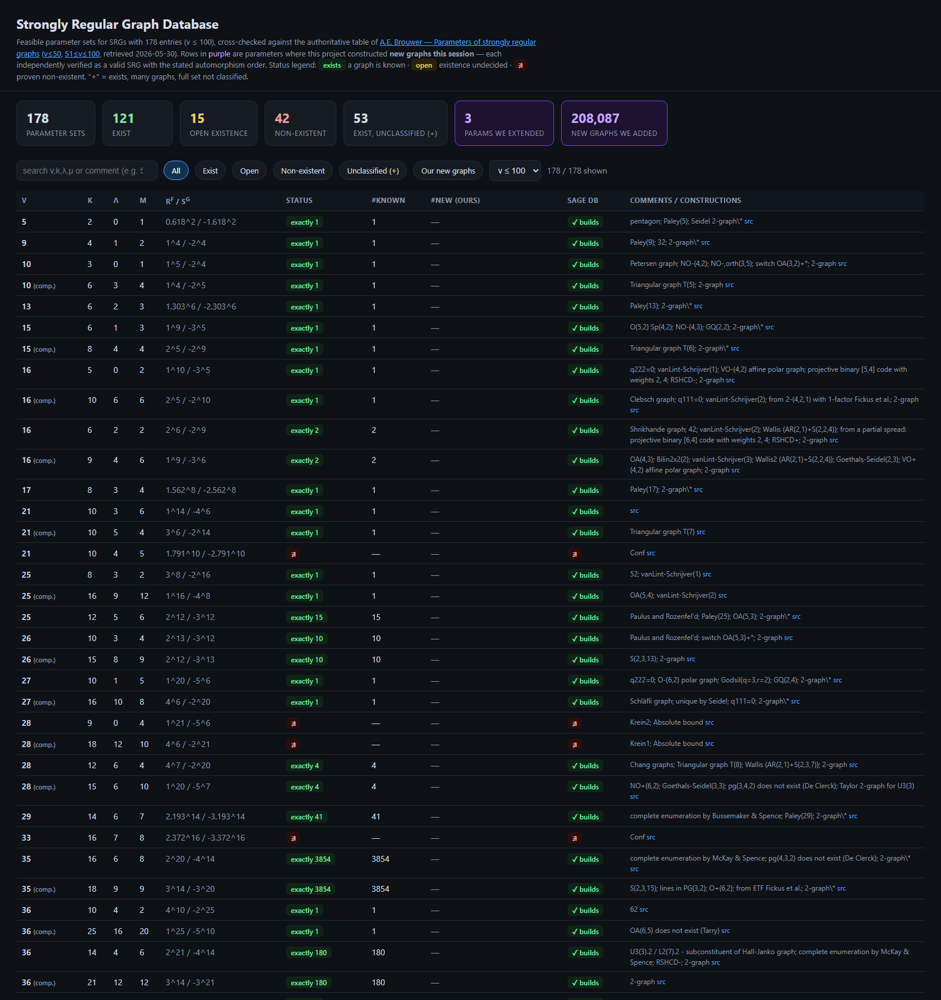

# SRG Database

A cross-checked database of **strongly regular graph** parameters (v ≤ 100), annotated with
**newly constructed graphs** at four Brouwer-unclassified parameters — together with the draft
paper describing the construction and the graphs themselves.

## View the database

Open **[`index.html`](index.html)** directly in a browser (it is fully self-contained — data
embedded, no server needed), or enable **GitHub Pages** (Settings → Pages → branch `main`) to
browse it at `https://tonykoval.github.io/srg-database/`.

The page lists 178 feasible SRG parameter sets, each cross-checked against two independent
authorities — A. E. Brouwer's table and the SageMath `strongly_regular_db` — with live search,
filters, and click-to-sort. The four parameters extended by this work are highlighted.

## Results

Cascading single-cell **Godsil–McKay switching** from low-automorphism seeds constructs large
families of new, **asymmetric** strongly regular graphs at parameters that are known to be
realised but whose graphs are *not classified* (Brouwer "+"):

| Parameter | New graphs | Verification |
|---|---|---|
| SRG(50,21,8,9) | 16,939 | valid; `\|Aut\|`∈{1,2}; **disjoint** from Spence's downloadable 18 |
| SRG(50,28,15,16) | 16,939 | complements of the above |
| SRG(49,24,11,12) | 395,966 | valid; `\|Aut\|`=1 |
| SRG(57,24,11,9) | 1,122,556 | valid; `\|Aut\|`=1; **opened from a single SageMath seed** |
| SRG(57,32,16,20) | 1,122,556 | complements of SRG(57,24,11,9) |
| **Total** | **2,674,956** | all lower bounds (cascades can be continued) |

Every graph is asymmetric (`|Aut|` not divisible by 6), hence provably outside every published
prescribed-automorphism enumeration, and was independently re-verified by SageMath's
`is_strongly_regular()`. See the paper for the method, the cospectrality proof, the novelty
argument, and its honest limitations.

## Contents

- **[`index.html`](index.html)** — the interactive cross-checked database.
- **[`paper/`](paper/)** — the draft paper (PDF + LaTeX source): *Cascading Godsil–McKay
  Switching from Low-Symmetry Seeds: Constructing New Strongly Regular Graphs at Unclassified
  Parameters*.
- **[`catalogs/`](catalogs/)** — the constructed graphs in graph6 format (full SRG(50,…)
  catalogs; samples of the larger, still-growing SRG(49,…) and SRG(57,…) families).
- **[`docs/`](docs/)** — construction notes and a survey of the count literature & download
  sources.
- **[`data/`](data/)** — the Brouwer source tables and the SageMath existence verdicts, for audit.
- `build.py` — the generator that produces `index.html` (run against the
  [orbit-gen](https://github.com/tonykoval/orbit-gen) working tree).

## Provenance

Constructed and verified 2026-05-30. Method, tooling, and full (large) catalogs live in the
[orbit-gen](https://github.com/tonykoval/orbit-gen) repository. Source of truth for the
parameter table: [A. E. Brouwer, *Parameters of strongly regular graphs*](https://aeb.win.tue.nl/graphs/srg/).

🤖 Generated with [Claude Code](https://claude.com/claude-code)
